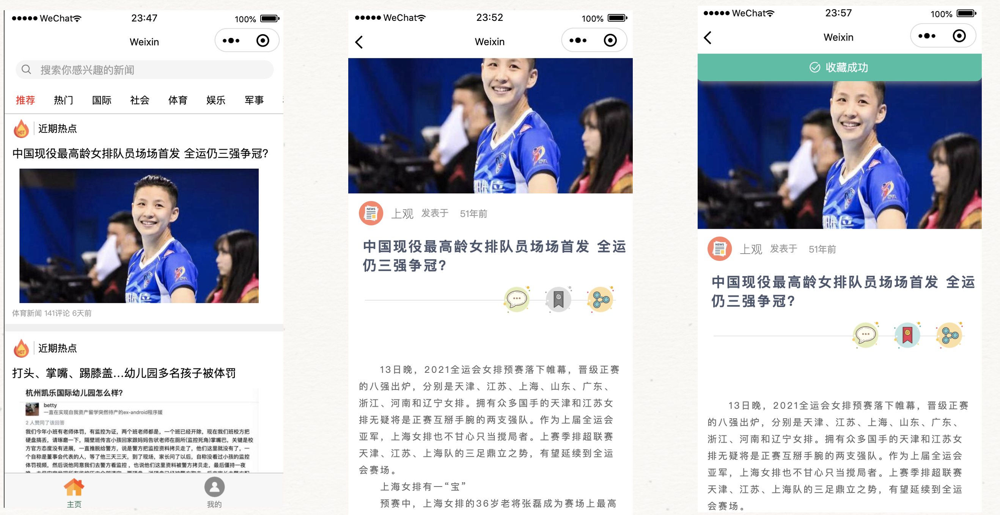
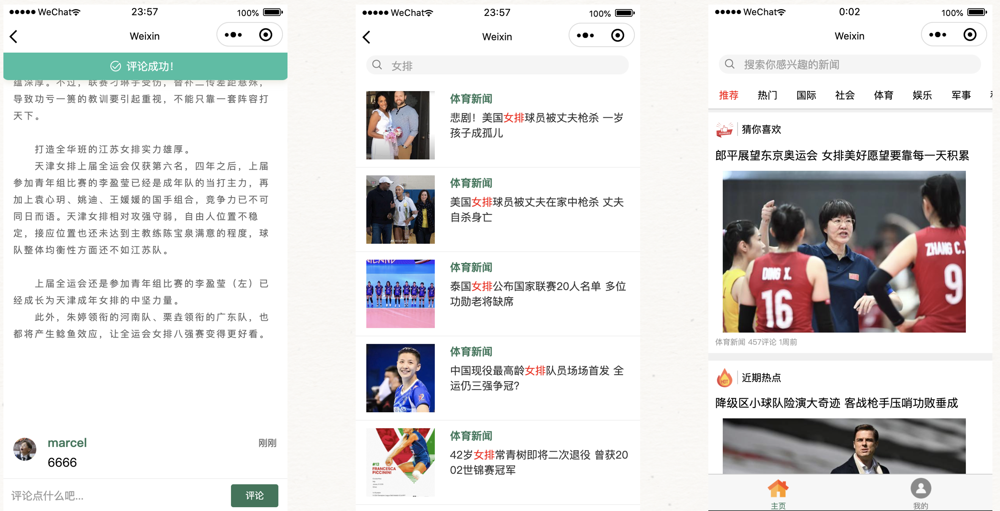
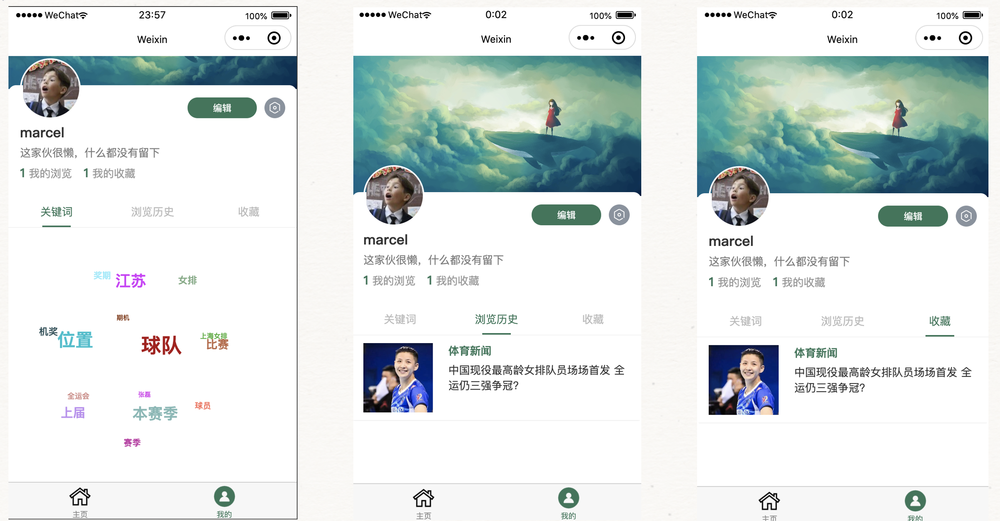
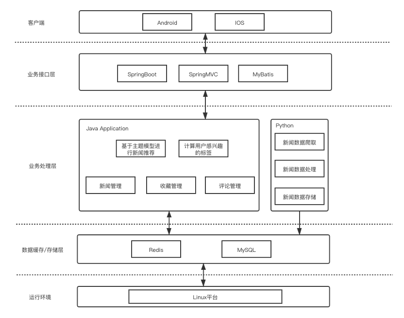
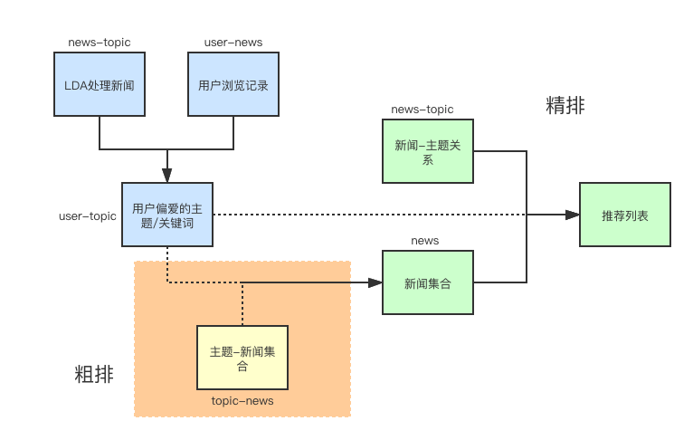

# 基于主题模型的个性化新闻推荐系统

### 项目开发背景

- 推荐算法只使用了主题模型
- 新闻数据集爬取的1000条新浪新闻，对这1000条数据集进行主题提取，然后对1000条数据进行新闻推荐（即新闻集合是固定集合，而非增量）
- 数据预处理采用Python开发，后端服务采用Java开发，前端采用微信小程序进行开发

### 项目使用技术

- Python + jieba + gensim
- Java + SpringBoot + MyBatis
- MySQL + Redis
- 微信小程序

### 项目效果演示

### 项目模块说明

- newsRecommend/TouTiaoNewsScraper （Python）

  - 爬取新浪新闻数据，进行数据处理和清洗，再利用主题模型进行处理，最后将处理后的**新闻-主题向量**放入Redis和MySQL中

- newsRecommend/recommend （$Java$）

  

  - 利用用户浏览记录和新闻-主题向量**分析出用户的主题偏好**，然后对新的新闻进行评分计算，进行排序推荐
  - 由于待计算的新闻较多，引入粗排和精排的概念，**以减少待计算的新闻**

- newsRecommend/NewsRecommend （微信小程序前端）

  - 以小程序的形式提供前端数据展示

### 项目搭建说明

- 打开newsRecommend/mysql中的文件，创建数据库
- 爬取并处理新闻数据
  - 打开newsRecommend/TouTiaoNewsScraper文件，修改config.ini中的配置为自己想要的配置，主要是修改拉取的新闻页数和希望拉取的新闻时间
  - 修改mysql_utils.py和redis_utils.py中的云服务器信息和表名等信息
  - 执行 `sh start.sh` 运行代码，运行过程中日志会被记录到logs中，可以点击查看
  - 代码执行完成后，结果会被存储到MySQL和Redis中
- 打开并运行newsRecommend/recommend
  - 运行之前，修改application.properties中的云服务器相关配置和https相关配置
  - 根据需要更改NConstants中的常量，特别是微信登录相关的配置

- 利用微信开发者工具，打开并执行newsRecommend/NewsRecommend
  - 运行前需要修改各个js文件中的云服务器host
- 通过微信开发者工具，观察展示的效果

### 联系方式
1796466322@qq.com
